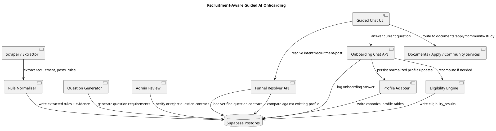

# Recruitment-Aware Guided AI Onboarding Chatbot

_Date: 2026-05-11_

## Purpose

This document defines the implementation plan for a recruitment-aware onboarding chatbot in Career Copilot.

The goal is to convert SEO/blog traffic into precise user actions such as:

- check eligibility for a specific recruitment/post,
- understand required documents,
- view how to apply,
- join a study group,
- start a study plan.

The chatbot must not invent eligibility questions or decide eligibility by itself. It must ask questions derived from verified recruitment rules and save answers into the canonical candidate profile. The deterministic eligibility engine remains the only authority for eligibility verdicts.

## Core Principle

Use a hybrid architecture:

```txt
Scraper/Admin creates the verified question contract.
Chatbot follows the contract.
Profile adapter persists candidate answers.
Eligibility runner computes the verdict.
AI explains the flow and result, but never overrides rules.
```

The chatbot is a conversation layer over deterministic contracts, not a free-form eligibility engine.

## Current Repo Context

Relevant existing pieces:

- `app/frontend/src/pages/Landing.jsx` - public homepage and general CTA surface.
- `app/frontend/src/pages/Onboarding.jsx` - current multi-step onboarding form.
- `app/frontend/src/features/onboarding/onboardingSchema.js` - current zod validation schema.
- `app/frontend/src/pages/AIChat.jsx` - generic AI chat page.
- `app/backend/app/api/eligibility.py` - deterministic eligibility recompute and result endpoints.
- `app/backend/server.py` - central backend router registration.
- `docs/engineering/source-intelligence.md` - source trust and scraper strategy.
- `docs/schema/profile_schema_lineage_audit.md` - profile schema drift and canonical profile guidance.

This implementation should not replace the deterministic eligibility engine. It should add a new guided onboarding path that reuses the existing auth, profile, recruitment, and eligibility infrastructure.

## Target User Flow

Example CTA URL from a recruitment blog:

```txt
/go/check-eligibility/cnp-nashik-2026/safety-officer
/go/documents-required/cnp-nashik-2026/safety-officer
/go/how-to-apply/cnp-nashik-2026
/go/join-study-group/cnp-nashik-2026
```

Flow:

```txt
Blog CTA
  -> Funnel route resolves intent + recruitment + post
  -> Backend loads verified post-wise question contract
  -> Backend compares contract against existing candidate profile
  -> Chatbot asks only missing questions
  -> Answers are saved to onboarding_answers and canonical profile tables
  -> If intent is check_eligibility, eligibility recompute runs
  -> User sees verdict and next actions
```

If the CTA is recruitment-level and not post-level, the chatbot should first ask which post the user wants to check.

## Architecture Overview



## Data Model Additions

Create migration:

```txt
app/supabase/migrations/084_candidate_question_contracts.sql
```

### 1. `candidate_field_registry`

Canonical registry for all candidate fields that may be asked in onboarding, profile, eligibility, documents, or study flows.

```sql
create table if not exists public.candidate_field_registry (
  field_key text primary key,
  canonical_label text not null,
  user_facing_label text not null,
  data_type text not null check (data_type in ('text', 'number', 'date', 'boolean', 'single_select', 'multi_select', 'json')),
  profile_group text not null,
  profile_table text,
  profile_column text,
  question_template text,
  help_text text,
  allowed_values jsonb default '[]'::jsonb,
  synonyms text[] default '{}',
  is_active boolean default true,
  created_at timestamptz default now(),
  updated_at timestamptz default now()
);
```

Initial seed:

```sql
insert into public.candidate_field_registry
(field_key, canonical_label, user_facing_label, data_type, profile_group, profile_table, profile_column, question_template, synonyms)
values
('date_of_birth', 'Date of birth', 'Date of birth', 'date', 'identity', 'profiles', 'date_of_birth', 'What is your date of birth?', array['dob','birth date']),
('reservation_category', 'Reservation category', 'Reservation category', 'single_select', 'reservation', 'profiles', 'category', 'Which reservation category should we use?', array['category','caste category']),
('domicile_state', 'Domicile state', 'Domicile state', 'single_select', 'location', 'profiles', 'domicile_state', 'What is your domicile state?', array['state','home state']),
('highest_qualification_level', 'Highest qualification level', 'Highest completed qualification', 'single_select', 'education', 'aspirant_education', 'level', 'What is your highest completed qualification?', array['education level','qualification']),
('qualification_discipline', 'Branch / discipline', 'Branch / discipline', 'text', 'education', 'aspirant_education', 'stream', 'What is your branch or discipline?', array['stream','subject','branch']),
('qualification_class', 'Qualification class', 'Class / division', 'single_select', 'education', 'aspirant_education', 'class_division', 'Did you pass with 1st class?', array['first class','division']),
('qualification_percentage', 'Qualification percentage', 'Percentage / marks', 'number', 'education', 'aspirant_education', 'percentage', 'What percentage did you score in your qualifying exam?', array['marks','percentage']),
('has_marathi_knowledge', 'Adequate knowledge of Marathi', 'Marathi language knowledge', 'boolean', 'language', null, null, 'Do you possess adequate knowledge of Marathi language?', array['marathi','language knowledge']),
('has_industrial_safety_diploma', 'Diploma in Industrial Safety', 'Industrial Safety diploma', 'boolean', 'certification', 'aspirant_certifications', 'certification_name', 'Do you have a Diploma in Industrial Safety from a recognized institution?', array['industrial safety diploma','safety diploma']),
('factory_supervisory_experience_years', 'Factory supervisory experience', 'Factory supervisory experience', 'number', 'experience', 'aspirant_experience', 'years_experience', 'How many years of supervisory experience do you have in a factory?', array['factory experience','supervisory experience'])
on conflict (field_key) do nothing;
```

### 2. `recruitment_question_requirements`

Stores verified, post-wise question contracts generated from recruitment rules.

```sql
create table if not exists public.recruitment_question_requirements (
  id uuid primary key default gen_random_uuid(),
  recruitment_id uuid not null,
  post_id uuid,
  field_key text not null references public.candidate_field_registry(field_key),
  requirement_type text not null,
  required_for text not null default 'eligibility',
  priority int default 100,
  question_text text not null,
  help_text text,
  options jsonb default '[]'::jsonb,
  rule_operator text,
  rule_value jsonb default '{}'::jsonb,
  applies_when jsonb default '{}'::jsonb,
  is_knockout boolean default false,
  evidence_id uuid,
  reviewer_status text not null default 'pending' check (reviewer_status in ('pending', 'verified', 'rejected')),
  created_at timestamptz default now(),
  updated_at timestamptz default now()
);

create index if not exists idx_rqr_recruitment_post
on public.recruitment_question_requirements(recruitment_id, post_id);

create index if not exists idx_rqr_field_key
on public.recruitment_question_requirements(field_key);

create index if not exists idx_rqr_verified
on public.recruitment_question_requirements(recruitment_id, post_id, required_for, reviewer_status);
```

### 3. `funnel_sessions`

Tracks blog CTA visits and resumes anonymous or authenticated flows.

```sql
create table if not exists public.funnel_sessions (
  id uuid primary key default gen_random_uuid(),
  user_id uuid null references auth.users(id),
  anonymous_id text,
  recruitment_id uuid,
  post_id uuid,
  intent text not null,
  source text,
  utm jsonb default '{}'::jsonb,
  status text not null default 'started',
  created_at timestamptz default now(),
  updated_at timestamptz default now()
);

create index if not exists idx_funnel_sessions_user
on public.funnel_sessions(user_id, status);

create index if not exists idx_funnel_sessions_anonymous
on public.funnel_sessions(anonymous_id, status);
```

### 4. `onboarding_sessions`

Tracks guided chat progress.

```sql
create table if not exists public.onboarding_sessions (
  id uuid primary key default gen_random_uuid(),
  user_id uuid null references auth.users(id),
  funnel_session_id uuid references public.funnel_sessions(id),
  mode text not null default 'chat',
  current_field_key text,
  missing_fields text[] default '{}',
  completed_fields text[] default '{}',
  status text not null default 'active',
  created_at timestamptz default now(),
  updated_at timestamptz default now()
);
```

### 5. `onboarding_answers`

Interaction log. This is not the source of truth. Canonical profile writes happen through the profile adapter.

```sql
create table if not exists public.onboarding_answers (
  id uuid primary key default gen_random_uuid(),
  session_id uuid references public.onboarding_sessions(id),
  user_id uuid null references auth.users(id),
  field_key text not null references public.candidate_field_registry(field_key),
  answer_value jsonb,
  normalized_value jsonb,
  source text not null default 'guided_chat',
  confidence numeric,
  needs_review boolean default false,
  created_at timestamptz default now()
);
```

### 6. `funnel_events`

```sql
create table if not exists public.funnel_events (
  id uuid primary key default gen_random_uuid(),
  funnel_session_id uuid references public.funnel_sessions(id),
  user_id uuid null references auth.users(id),
  event_name text not null,
  event_payload jsonb default '{}'::jsonb,
  created_at timestamptz default now()
);
```

### 7. Optional `knowledge_base_university_thresholds`

Used only when notifications mention class/division requirements but do not define thresholds.

```sql
create table if not exists public.knowledge_base_university_thresholds (
  id uuid primary key default gen_random_uuid(),
  university_name text not null,
  qualification_level text,
  first_class_min_percentage numeric,
  distinction_min_percentage numeric,
  source_url text,
  verification_status text default 'unverified',
  created_at timestamptz default now()
);
```

## Scraper and Extraction Pipeline Changes

Current scraper should be extended so every promoted recruitment has rule-driven question contracts.

Target stages:

```txt
discovery
  -> official source resolution
  -> notification fetch
  -> recruitment extraction
  -> post extraction
  -> eligibility rule extraction
  -> canonical field mapping
  -> question contract generation
  -> admin review
  -> promotion
```

### Extracted rule shape

Use an intermediate normalized rule shape before writing questions:

```json
{
  "post_name": "Safety Officer",
  "rule_type": "certification",
  "source_text": "Diploma in Industrial Safety from the recognized Institution.",
  "field_keys": ["has_industrial_safety_diploma"],
  "is_knockout": true,
  "evidence_id": "..."
}
```

### Rule-to-field mapping examples

```txt
"18 years to 30 years" -> date_of_birth
"adequate knowledge of Marathi" -> has_marathi_knowledge
"Diploma in Industrial Safety" -> has_industrial_safety_diploma
"1st class" -> qualification_class
"Diploma in Information Technology / Computer Science" -> highest_qualification_level + qualification_discipline
"factory in supervisory capacity" -> factory_supervisory_experience_years
```

### Deterministic mapper first

Start with deterministic keyword/rule mapping. Add AI-assisted mapping later only as a suggestion layer requiring admin verification.

```python
def map_rule_to_field_keys(rule_text: str) -> list[str]:
    text = rule_text.lower()
    keys: list[str] = []

    if 'age' in text or 'years' in text:
        keys.append('date_of_birth')
    if 'marathi' in text:
        keys.append('has_marathi_knowledge')
    if 'industrial safety' in text:
        keys.append('has_industrial_safety_diploma')
    if '1st class' in text or 'first class' in text:
        keys.append('qualification_class')
    if any(x in text for x in ['diploma', 'degree', 'b.tech', 'b.e.', 'b.sc']):
        keys.extend(['highest_qualification_level', 'qualification_discipline'])
    if 'supervisory capacity' in text or 'experience' in text:
        keys.append('factory_supervisory_experience_years')

    return sorted(set(keys))
```

## Admin Review Requirement

Do not expose generated question contracts directly to users.

Admin must verify:

- extracted rule text,
- mapped `field_key`,
- generated `question_text`,
- answer type/options,
- knockout status,
- linked evidence,
- post association.

Only rows with `reviewer_status='verified'` are eligible for chatbot flows.

Admin review display should show:

```txt
Post: Safety Officer
Rule: Possesses adequate knowledge of Marathi language.
Mapped field: has_marathi_knowledge
Generated question: Do you possess adequate knowledge of Marathi language?
Answer type: boolean
Eligibility impact: knockout
Evidence: notification snippet/page
Action: approve / edit / reject
```

## Backend Implementation

Create:

```txt
app/backend/app/api/onboarding_chat.py
app/backend/app/recruitment_questions/field_registry.py
app/backend/app/recruitment_questions/question_contracts.py
app/backend/app/recruitment_questions/profile_diff.py
app/backend/app/recruitment_questions/answer_parser.py
app/backend/app/recruitment_questions/profile_adapter.py
```

Register the API router in `app/backend/server.py` before `placeholders_router`:

```python
from app.api.onboarding_chat import router as onboarding_chat_router

api.include_router(onboarding_chat_router)
```

### API Endpoints

#### `GET /api/funnel/resolve`

Query params:

```txt
intent=check_eligibility
recruitment_slug=cnp-nashik-2026
post_slug=safety-officer
anonymous_id=optional
```

Responsibilities:

1. Resolve recruitment by slug.
2. Resolve post by slug if provided.
3. If post is not provided and recruitment has multiple posts, return `requires_post_selection=true`.
4. Load verified question requirements for the intent.
5. Compare requirements against existing candidate profile.
6. Create or resume funnel/onboarding session.
7. Return ordered missing questions.

Response shape:

```json
{
  "intent": "check_eligibility",
  "recruitment": {
    "id": "...",
    "slug": "cnp-nashik-2026",
    "title": "CNP Nashik Recruitment 2026"
  },
  "post": {
    "id": "...",
    "slug": "safety-officer",
    "name": "Safety Officer"
  },
  "requires_post_selection": false,
  "funnel_session_id": "...",
  "onboarding_session_id": "...",
  "missing_questions": [
    {
      "field_key": "has_marathi_knowledge",
      "question_text": "Do you possess adequate knowledge of Marathi language?",
      "data_type": "boolean",
      "options": [],
      "priority": 60,
      "help_text": null
    }
  ],
  "next_action": "start_chat"
}
```

#### `POST /api/onboarding-chat/start`

Starts or resumes a chat session. It should not generate new requirements. It only reads the verified contract.

#### `POST /api/onboarding-chat/answer`

Request:

```json
{
  "session_id": "...",
  "field_key": "has_marathi_knowledge",
  "raw_answer": "yes, I can read and write Marathi"
}
```

Server responsibilities:

1. Validate that `field_key` belongs to the current session requirements.
2. Parse answer according to registry `data_type`.
3. Store `onboarding_answers`.
4. Update `completed_fields`.
5. Persist normalized answer via profile adapter if possible.
6. Return next question or completion state.

#### `POST /api/onboarding-chat/complete`

Responsibilities:

1. Verify all required fields are answered or marked conditional.
2. If intent is `check_eligibility`, call eligibility recompute for the current user.
3. Return verdict/result summary and next CTAs.

## AI Usage Boundary

AI may be used for conversation polish and answer parsing only.

Allowed:

- ask the current backend-provided question,
- rephrase help text,
- parse free text into structured answer,
- detect ambiguous responses,
- explain deterministic eligibility verdicts.

Forbidden:

- invent new eligibility rules,
- decide eligibility,
- override `field_key`,
- ask questions outside the verified contract,
- modify recruitment rules,
- treat unverified extracted data as final.

System instruction for guided AI parser:

```txt
You are a guided onboarding assistant for Career Copilot.
You may only ask or clarify the current question provided by the backend.
You must not invent eligibility rules.
You must not decide eligibility.
You must not change field_key values.
Return structured JSON matching the requested data type.
If the user's answer is ambiguous, ask a clarification or mark needs_clarification=true.
```

Expected parser output:

```json
{
  "field_key": "has_industrial_safety_diploma",
  "answer_value": true,
  "confidence": 0.92,
  "needs_clarification": false,
  "assistant_reply": "Noted. I will mark that you have a Diploma in Industrial Safety."
}
```

## Frontend Implementation

Add routes:

```jsx
<Route path="/go/:intent/:recruitmentSlug/:postSlug?" element={<FunnelLandingRouter />} />
<Route path="/app/onboarding/chat" element={<OnboardingChat />} />
```

Create files:

```txt
app/frontend/src/pages/OnboardingChat.jsx
app/frontend/src/features/onboarding-chat/ChatShell.jsx
app/frontend/src/features/onboarding-chat/QuestionBubble.jsx
app/frontend/src/features/onboarding-chat/AnswerInput.jsx
app/frontend/src/features/onboarding-chat/useOnboardingChat.js
app/frontend/src/features/funnel/FunnelLandingRouter.jsx
app/frontend/src/features/funnel/funnelIntentConfig.js
```

### `FunnelLandingRouter`

Responsibilities:

1. Read `intent`, `recruitmentSlug`, `postSlug` from route params.
2. Preserve UTM params.
3. Call `/api/funnel/resolve`.
4. If unauthenticated and the flow needs saved profile, redirect to signup/login while preserving intent state.
5. If post selection is required, show post selector.
6. If missing questions exist, route to `/app/onboarding/chat`.
7. If no missing questions exist, route directly to final action.

### `OnboardingChat`

Responsibilities:

1. Load session and missing questions.
2. Show recruitment/post-aware intro.
3. Ask one question at a time.
4. Submit answers to `/api/onboarding-chat/answer`.
5. Render next question or completion state.
6. On completion, call `/api/onboarding-chat/complete`.
7. Render verdict and next CTAs.

Intro example:

```txt
I will check your eligibility for Safety Officer.
This post needs qualification, experience, Marathi knowledge, and Industrial Safety diploma details.
I will ask only the missing details.
```

## Profile Adapter Rules

`onboarding_answers` is only an interaction log. The source of truth remains canonical profile tables.

Mapping examples:

```txt
date_of_birth -> profiles.date_of_birth
reservation_category -> profiles.category
domicile_state -> profiles.domicile_state
highest_qualification_level -> aspirant_education.level
qualification_discipline -> aspirant_education.stream
qualification_percentage -> aspirant_education.percentage
has_industrial_safety_diploma -> aspirant_certifications.certification_name
factory_supervisory_experience_years -> aspirant_experience.years_experience
```

Short-term fallback is allowed only if the canonical table is not wired yet. Long-term writes should follow the normalized profile model from `docs/schema/profile_schema_lineage_audit.md`.

## Handling Ambiguous Answers

Example: User is asked whether they have 1st class and replies `76%`.

Algorithm:

```python
def handle_first_class_response(answer, rule, user_profile):
    percentage = parse_percentage(answer)
    if percentage is None:
        return ask_user_yes_no('Did you pass with 1st class?')

    threshold = rule.get('classification_threshold_percentage')
    if threshold is not None:
        return percentage >= threshold

    if user_profile.get('university'):
        threshold = lookup_university_threshold(user_profile['university'])
        if threshold is not None:
            return percentage >= threshold

    return ask_user_yes_no(
        f'Is {percentage}% considered 1st class at your university?'
    )
```

If the system cannot confidently normalize an answer, mark it conditional rather than silently converting it.

## Sample Question Contract: Safety Officer

```json
{
  "post_name": "Safety Officer",
  "required_questions": [
    {
      "field_key": "date_of_birth",
      "requirement_type": "age",
      "question_text": "What is your date of birth?",
      "is_knockout": true,
      "priority": 10
    },
    {
      "field_key": "highest_qualification_level",
      "requirement_type": "education",
      "question_text": "What is your highest completed qualification?",
      "is_knockout": true,
      "priority": 20
    },
    {
      "field_key": "qualification_discipline",
      "requirement_type": "education",
      "question_text": "What is your branch or discipline?",
      "is_knockout": true,
      "priority": 30
    },
    {
      "field_key": "qualification_class",
      "requirement_type": "education",
      "question_text": "Did you pass with 1st class?",
      "is_knockout": true,
      "priority": 40
    },
    {
      "field_key": "factory_supervisory_experience_years",
      "requirement_type": "experience",
      "question_text": "How many years of supervisory experience do you have in a factory?",
      "is_knockout": true,
      "priority": 50
    },
    {
      "field_key": "has_marathi_knowledge",
      "requirement_type": "language",
      "question_text": "Do you possess adequate knowledge of Marathi language?",
      "is_knockout": true,
      "priority": 60
    },
    {
      "field_key": "has_industrial_safety_diploma",
      "requirement_type": "certification",
      "question_text": "Do you have a Diploma in Industrial Safety from a recognized institution?",
      "is_knockout": true,
      "priority": 70
    }
  ]
}
```

## Testing Plan

Backend tests:

1. `/api/funnel/resolve` returns only `reviewer_status='verified'` questions.
2. Existing profile fields are skipped from `missing_questions`.
3. Unknown `field_key` in `/api/onboarding-chat/answer` is rejected.
4. User cannot answer a field outside the current session contract.
5. Ambiguous answers are marked `needs_clarification`.
6. `onboarding_answers` stores raw and normalized values.
7. Profile adapter writes to expected canonical tables.
8. Eligibility recompute is called only after required answers are complete.
9. Guest session can be resumed by `anonymous_id`.
10. Authenticated session can be resumed by `user_id`.

Frontend tests:

1. Funnel route resolves intent and recruitment/post slugs.
2. Post selector appears when post is missing.
3. Chat asks questions in priority order.
4. Answer submission renders the next question.
5. Completion screen shows verdict and next CTAs.
6. Login/signup preserves funnel context.

Scraper/admin tests:

1. Extracted Marathi rule maps to `has_marathi_knowledge`.
2. Extracted Industrial Safety diploma rule maps to `has_industrial_safety_diploma`.
3. Extracted 1st class rule maps to `qualification_class`.
4. Unverified generated question does not appear in funnel resolver.
5. Rejected question does not appear in funnel resolver.

## Rollout Plan

### Phase 0 - Manual pilot

- Add schema.
- Seed registry.
- Manually insert question requirements for one known recruitment and one post.
- Build resolver and chat path.
- Test full loop from `/go/check-eligibility/...` to eligibility result.

Recommended pilot:

```txt
Recruitment: CNP-style recruitment from uploaded notification
Post: Safety Officer
Intent: check_eligibility
```

### Phase 1 - Post-wise coverage

- Add contracts for Welfare Officer and technical Supervisor posts.
- Add post selector when CTA is recruitment-level.
- Add documents-required flow.

### Phase 2 - Scraper integration

- Generate question requirements from extracted eligibility rules.
- Add admin review for generated contracts.
- Expose only verified question contracts.

### Phase 3 - AI parser

- Add guided AI answer parser.
- Keep strict field-key and schema validation.
- Use deterministic fallback where parser confidence is low.

### Phase 4 - Analytics and optimization

- Track funnel start, question answered, flow completed, eligibility computed, CTA clicked.
- Add resume prompts.
- Compare blog CTA conversion by intent and recruitment.

## Implementation Checklist

```txt
[ ] Add migration 084_candidate_question_contracts.sql
[ ] Seed candidate_field_registry
[ ] Add recruitment_question_requirements table
[ ] Add funnel_sessions, onboarding_sessions, onboarding_answers, funnel_events
[ ] Add backend onboarding_chat router
[ ] Register router in server.py before placeholders
[ ] Add profile diff service
[ ] Add profile adapter service
[ ] Add /api/funnel/resolve
[ ] Add /api/onboarding-chat/start
[ ] Add /api/onboarding-chat/answer
[ ] Add /api/onboarding-chat/complete
[ ] Add frontend FunnelLandingRouter
[ ] Add frontend OnboardingChat page
[ ] Add /go/:intent/:recruitmentSlug/:postSlug? route
[ ] Add /app/onboarding/chat route
[ ] Add post selector for recruitment-level CTA
[ ] Add manual pilot question contract
[ ] Add tests
[ ] Connect scraper-generated contracts after pilot succeeds
```

## Codex Implementation Prompt

```txt
You are working in repo ccp-mainbuild-v1.

Implement recruitment-aware guided AI onboarding.

Do not let AI decide eligibility. AI may only ask backend-provided questions and parse user answers into canonical field keys. The deterministic eligibility engine remains the only eligibility authority.

Tasks:
1. Add Supabase migration app/supabase/migrations/084_candidate_question_contracts.sql with:
   - candidate_field_registry
   - recruitment_question_requirements
   - funnel_sessions
   - onboarding_sessions
   - onboarding_answers
   - funnel_events
   - optional knowledge_base_university_thresholds
2. Seed candidate_field_registry with initial identity, reservation, domicile, education, language, certification, and experience fields.
3. Add backend router app/backend/app/api/onboarding_chat.py with:
   - GET /api/funnel/resolve
   - POST /api/onboarding-chat/start
   - POST /api/onboarding-chat/answer
   - POST /api/onboarding-chat/complete
4. Register onboarding_chat_router in app/backend/server.py before placeholders_router.
5. Add backend services under app/backend/app/recruitment_questions:
   - field_registry.py
   - question_contracts.py
   - profile_diff.py
   - answer_parser.py
   - profile_adapter.py
6. Add frontend route /go/:intent/:recruitmentSlug/:postSlug? and /app/onboarding/chat.
7. Add OnboardingChat.jsx and supporting feature files under src/features/onboarding-chat.
8. The chat must load verified question requirements, ask missing fields only, save answers, update profile, then call /api/eligibility/recompute for check_eligibility intent.
9. Add tests proving:
   - resolver returns only verified questions
   - answered profile fields are skipped
   - unknown field_key is rejected
   - user cannot answer a field outside the session contract
   - eligibility recompute is called only after required answers are complete
```

## Non-Negotiables

1. AI must not decide eligibility.
2. AI must not invent questions.
3. Chatbot questions must come from verified `recruitment_question_requirements`.
4. Candidate terminology must come from `candidate_field_registry`.
5. `onboarding_answers` must not become the source of truth.
6. Eligibility must be computed by the deterministic runner.
7. Aggregator-only or unverified recruitment data must not drive user-facing eligibility flows.
