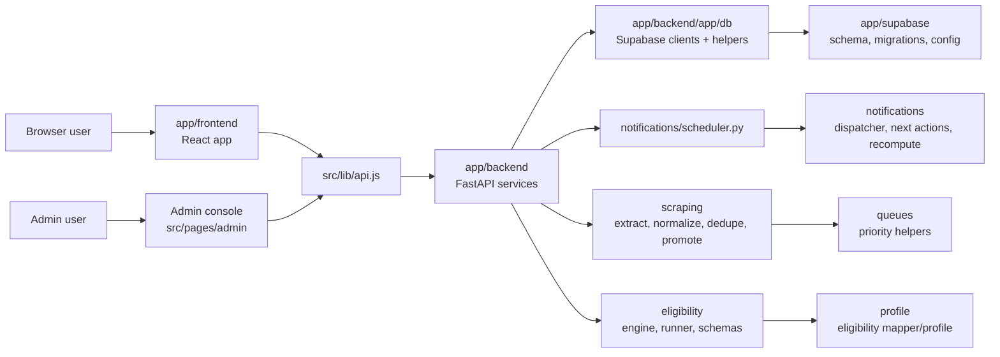
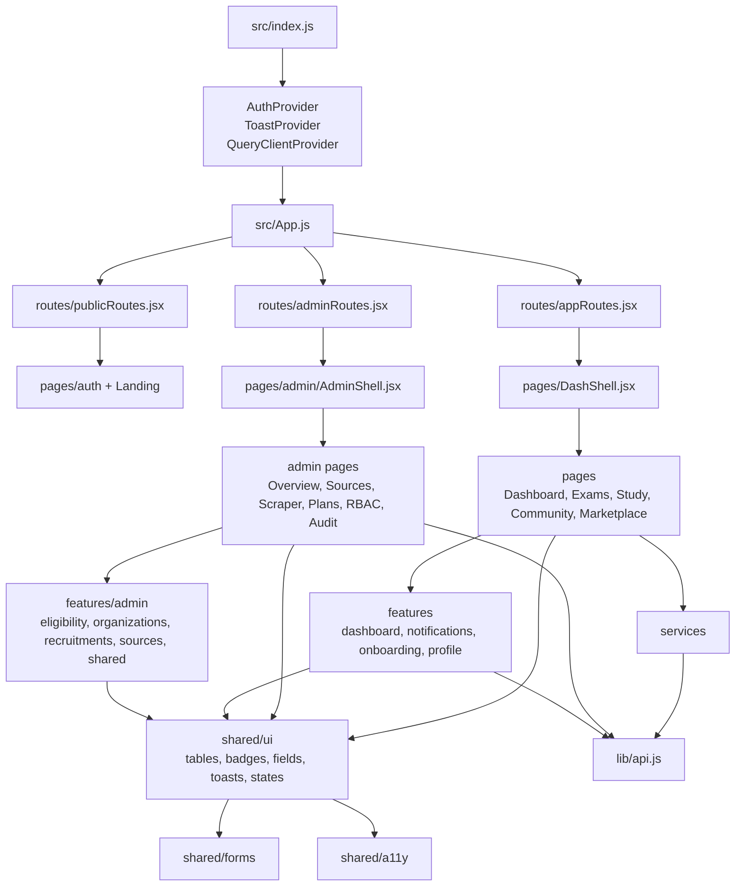
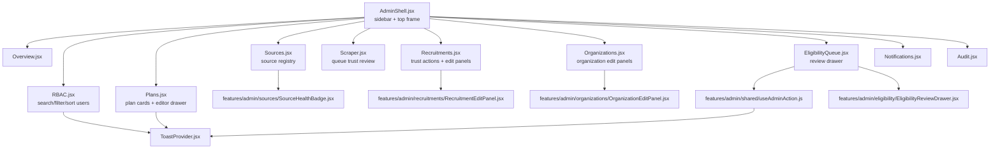
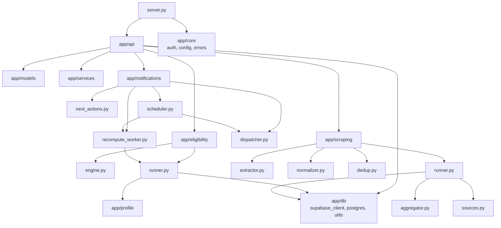
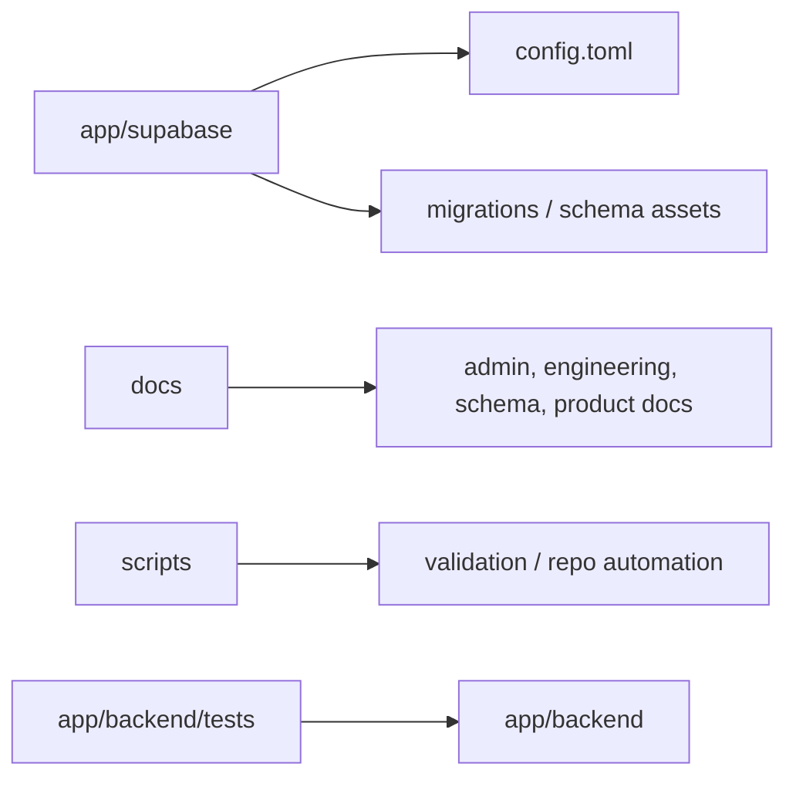

# Repository Graph

Generated from `D:\GovtExamAgent\ccp-mainbuild-v1` on 2026-05-11.

## Top-Level Runtime Map

## Frontend Module Graph

## Admin UX Graph

## Backend Module Graph

## Data And Deployment Assets

## Hotspots

- Admin UX is centered on `app/frontend/src/pages/admin/AdminShell.jsx` and `app/frontend/src/routes/adminRoutes.jsx`.
- Shared admin feedback currently flows through `app/frontend/src/shared/ui/ToastProvider.jsx` and `app/frontend/src/features/admin/shared/useAdminAction.js`.
- Recruitment trust and scraping behavior spans `app/frontend/src/pages/admin/Scraper.jsx`, `app/frontend/src/pages/admin/Recruitments.jsx`, and `app/backend/app/scraping`.
- Eligibility behavior spans frontend review drawers in `app/frontend/src/features/admin/eligibility` and backend verdict logic in `app/backend/app/eligibility`.
